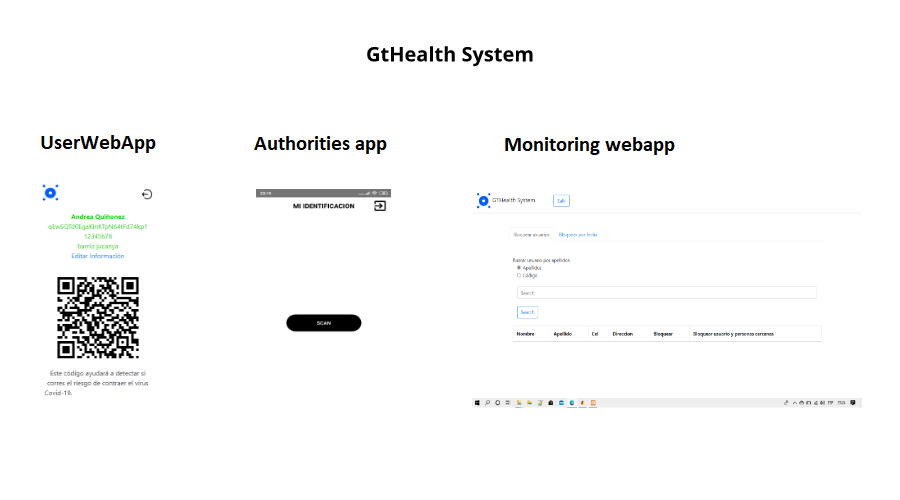

# gthealthsystem
System to detect people who were close to a person with coronavirus covid-19.
This system was created to help authorities to track places where people went. This will register the timestamp, the userid and the place id.

For system operation is necessary to use 3 aplications:

1. First application called appcentro is a native Android app that scan QR code and save the register.
2. Second application called appusuarios is a webapp. In this webapp users (people) can create their account and get a QR code. This QR code will be neccesary to enter to places.
3. Third application called webappmonitoreo is a webbapp where authorities can find the user historial and block them.

*This works with Firebase.
More Documentation: https://medium.com/@marvinhere/sistema-b%C3%A1sico-para-detecci%C3%B3n-de-personas-que-estuvieron-cerca-de-una-persona-contagiada-por-un-20eeb586a85c

